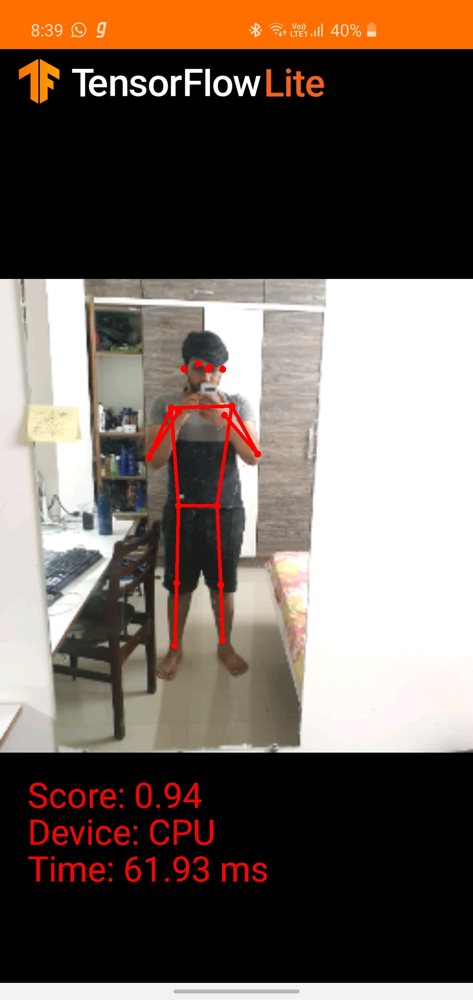

# Tensorflow_Android_PoseEstimation
Android Studio project implementing tensorflow pose estimation in real time.

<b> RESULTS:</b> [ Tested on Samsung S10]
 

More Info : https://www.tensorflow.org/lite/models/pose_estimation/overview
